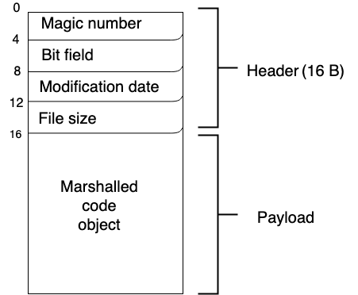

# The structure of CPython bytecode
## Gabriele Modena
### SWE @ ING Financial Crime Analytics

---
# Follow along
##

- `git clone https://github.com/gmodena/pycdump/`
- **Assume** Python = CPython
- **Assume** running on x86_64

<!--
You want to paste the URL and attach slides
-->

---

# Summary

- How does CPython execute (byte) code?
- How do **pyc** files look like?
- What tools are available to analyse bytecode?

---

# Why should I care?

- Get a better understanding of technology I use every day
  - Documentation is sometimes lacking / often out of date
- Python introspection has a lot of capabilities to offer
- There some practical use cases / considerations

---

# The Python virtual machine
### A bytecode interpreter 

<style scoped>
img {
display: block;
margin-left: auto;
margin-right: auto;
}
</style>


<!--
.pyc files are created by the Python interpreter when a .py file is imported. They contain the "compiled bytecode" of the imported module/program so that the "translation" from source code to bytecode (which only needs to be done once) can be skipped on subsequent imports if the .pyc is newer than the corresponding .py file, thus speeding startup a little. But it's still interpreted. Once the *.pyc file is generated, there is no need of *.py file, unless you edit it.
-->

---


# Bytecode
### It’s bytes all the way down

```python
def sum(a, b):
    return a + b

type(sum)

sum.__code__ # a code object to be executed

[co for co in sum.__code__.co_code] # raw compiled bytecode strings
```

---

# dis
### <!-- fit --> Disassemble classes, methods, functions, and other compiled objects.

```python
import dis
dis.dis(sum)
```

---


# Structure of a pyc file
<style scoped>
img {
display: block;
margin-left: auto;
margin-right: auto;
}
</style>


<!--
According to documentation a pyc file is composed of a 16 byte header - 4 32-bit words - and a variable size payload.
- *4B magic number*: used to differentiate which version of Python generated the file. See https://docs.python.org/3/library/importlib.html#importlib.util.MAGIC_NUMBER
- *4B bit field (PEP0552)*. At least on 3.7.3 this is left empty.
- *4B modification date*: the source file timestamp
- *4B file size*: the source file size
From byte 16 onwards the payload stores a marshalled code object (https://docs.python.org/3/c-api/code.html).
-->

---


# Code object
## A chunk of executable code
Code objects provide these attributes (and several more):
- **co_code** string of raw compiled bytecode
- **co_filename** name of file in which this code object was created
- **co_varnames** tuple of names of arguments and local variables
- **co_consts** a nested data structure that can contain code objects

--- 

# Disassembler (0)
### A simple python script

```bash
$ cat example.py
a, b = 1, 0
if a or b:
    print("Hello", a)
```

Given its bytecode represenation, can we regenerate the source?

---

# Disassembler (1)
### Compile to pyc

```bash
$ python -m compileall example.py 
```

A `pyc` looks like... bytes

```bash
$ cat __pycache__/example.cpython-37.pyc 
B
?S"^=?@s*d\ZZeserede?iZded<dS))??ZHellorrN)?a?b?print?c?rr?
example.py<module>s
```

---

# Disassembler (2)
### Parse the header and extract payload

<style scoped>
pre {
  font-size: 48%;
}
</style>

```python
FIELD_SIZE = 4  # 32 // 8

def main(fname):
    with open(fname, "rb") as infile:
        # Header: bytes 0 - 3
        magic_number = binascii.hexlify(infile.read(FIELD_SIZE))
        # Header: bytes 4 - 7
        bit_field = infile.read(FIELD_SIZE)

        # Header: bytes 8 - 11
        moddate = infile.read(FIELD_SIZE)

        # Header: bytes 12 - 15
        source_size = infile.read(FIELD_SIZE)

        modtime = time.asctime(time.localtime(struct.unpack("=L", moddate)[0]))
        source_size = struct.unpack("=L", source_size)
       
        # Payload : bytes 16 - ...
        code_obj = marshal.load(infile)
        frames = dump(code_obj)

        for tpl in frames:
            dis.disassemble(tpl[2])

```

---

# Disassembler (3)
### Unmarshall and dump the code object

<style scoped>
pre {
  font-size: 75%;
}
</style>
```python
def dump(code_obj):
    frames = []

    def ddump(code_obj):
        for const in code_obj.co_consts:
            if isinstance(const, CodeType):
                ddump(const)
        frames.append((code_obj.co_filename, code_obj.co_firstlineno, code_obj))

    ddump(code_obj)
    frames.sort(key=lambda tpl: tpl[1])
    return frames
```

---

# Disassembler (4)
```bash
$ python dump.py __pycache__/example.cpython-37.pyc
```

--- 

# Use case: coverage.py


From https://coverage.readthedocs.io/en/coverage-5.3/howitworks.html

_After your program has been executed and the line numbers recorded, coverage.py needs to determine what lines could have been executed. Luckily, compiled Python files (.pyc files) have a table of line numbers in them. Coverage.py reads this table to get the set of executable lines_

---
# Use case: malware (analysis)

- *Reversing a Simple Python Ransomware* https://or10nlabs.tech/reversing-a-simple-python-ransomware/
- Mask payload binary patches by tampering with the header


---
# Use case: PEP552
### Deterministic pycs

https://www.python.org/dev/peps/pep-0552/
- Reproducible builds (same input code generates the same pyc files)
- Timestamp header field makes pyc non deterministic 
- PEP proposes allowing the timestamp to be replaced with a deterministic hash

---

# References

 - https://github.com/gmodena/pycdump/
 - https://nedbatchelder.com/blog/200804/the_structure_of_pyc_files.html
 - https://docs.python.org/3/c-api/code.html

---
# The end
<style scoped>
img {
display: block;
margin-left: auto;
margin-right: auto;
}
</style>


